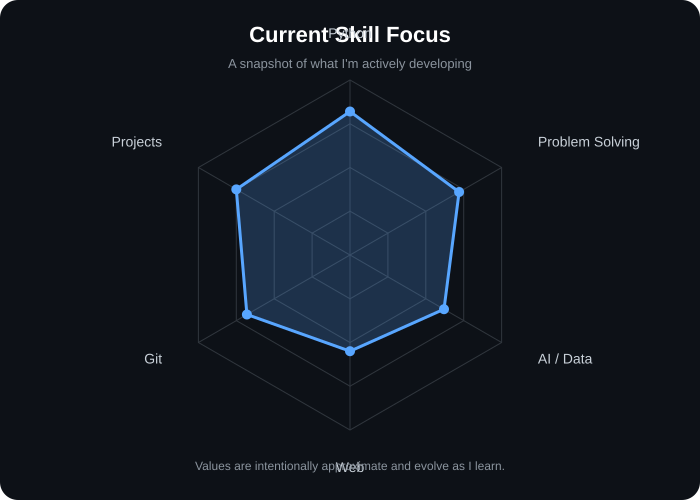

<div align="center">
<p align="center">
  
</p>
# Hey, I'm Sunal 👋

### CSE Student @ VIT Chennai • Developer • Builder • Hackathon Enthusiast

<a href="https://www.linkedin.com/in/sunal-sharma-3170aa284/">
  
</a>
<a href="https://github.com/SunalSharma">
  
</a>

</div>

---

<div align="center">
  
</div>

## `whoami`

```text
I'm Sunal — a CSE student at VIT Chennai, currently learning by building.

I enjoy turning ideas into working projects, experimenting with AI/software,
and taking on hackathons where I can learn something new under pressure.

Currently exploring:
→ Python & problem solving
→ Data Science / AI
→ Competitive Programming
→ Software Development
→ Robotics & swarm-drone systems
```

## 🚀 What I've been building

| Project | What it does |
|---|---|
| 🩺 **MedInsight** | Organizes and surfaces patient medical history on top of existing hospital systems. |
| 🌐 **Campus Flow** | A campus-focused project built to make student workflows/services easier. |
| 🚁 **Swarm Drone Project** | Explored coordinated multi-drone behavior and swarm-based systems. |
| 🏆 **Hackathon Projects** | Rapid prototypes focused on solving real-world problems with software. |

> More projects are being added as I build and learn.

## 🧰 Tech I'm working with

<p align="center">
  
</p>

## 📊 GitHub

<p align="center">
  
  
</p>

## 🧠 Current focus

<p align="center">
  
</p>

## 📈 Contribution graph

<p align="center">
  
</p>

---

<div align="center">

### Let's build something interesting.

**Learning → Building → Breaking → Fixing → Shipping 🚀**

</div>
